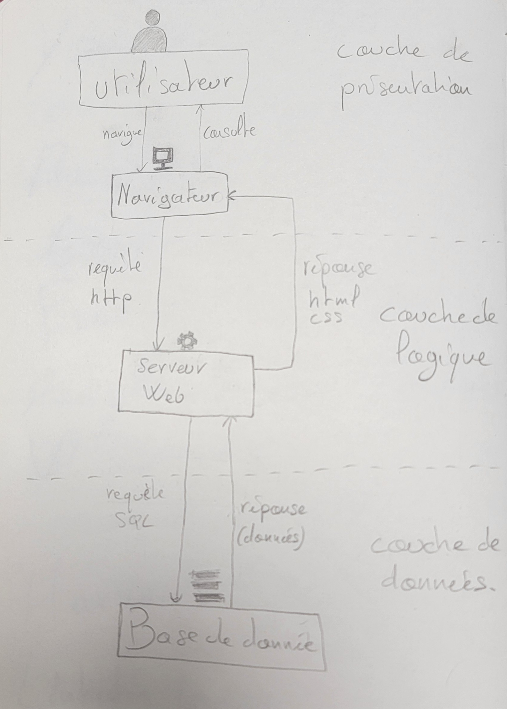

# Concept de bases de données

Schéma permettant de situer une base de donnée dans une architecture web ainsi qu'un glossaire des termes en lien avec les BDD.

Qu'est ce qu'une base de donnée : https://www.data-bird.co/blog/base-de-donnees

- # Shéma d'un architecture web

  

- # Glossaires des termes liés aux bases de données

    | Termes | Définition |
    | - | - |
    | SGBD | Systèmede gestion de base de donnée, sert à gérer grace à une interface graphique des bases dedonnées |
    | SQL | Language de requête qui permet de manipuler, afficher des données d'une base de données |
    | Banque de données | Contient des bases de données |
    | bases de données | Système permettant le stockage de données |
    | Tables | tableau composé de lignes et de colonnes contenant les données |
    | lignes d'enregistrement | Lignes d'un tableau chacune représentant un objet |
    | Colonnes | Chaques données appartenant à un objet. |
    | Clés | Colonnes permettant de mettre en relation différentes tables contenant les mêmes objets mais avec différentes données |
    | Relations | Lien entre les données des différentes tables |
