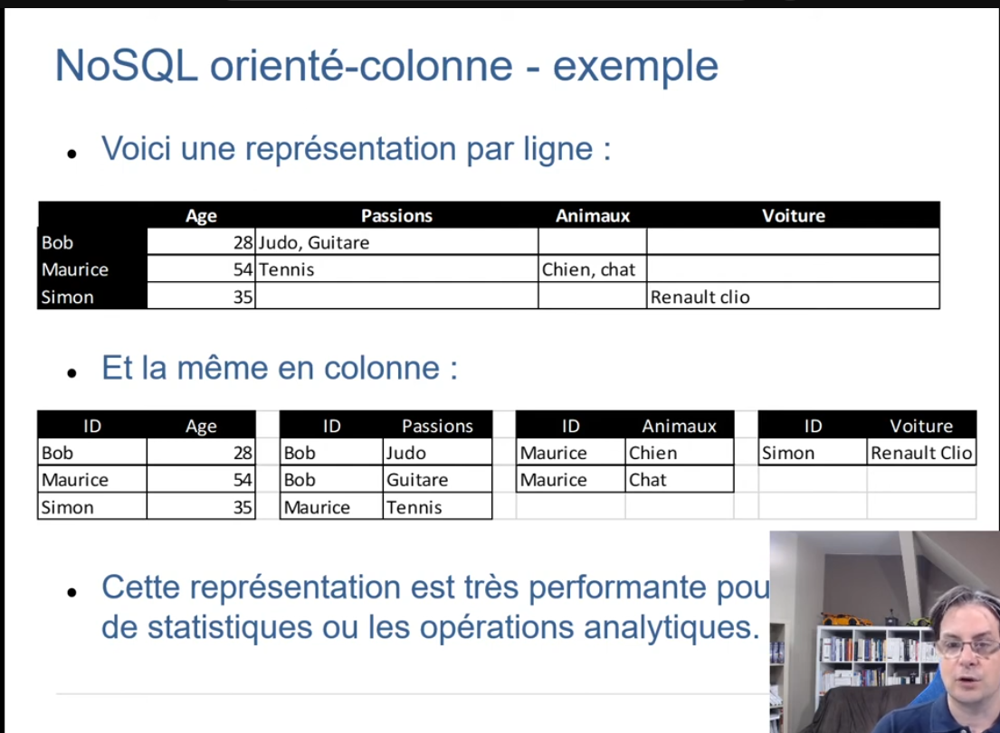
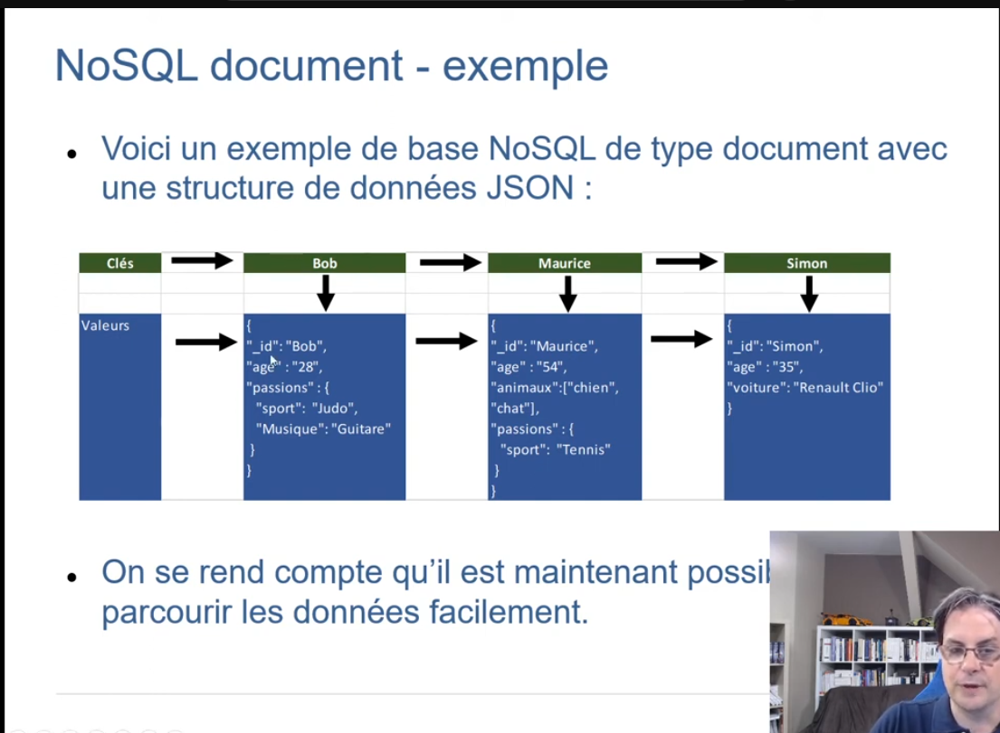
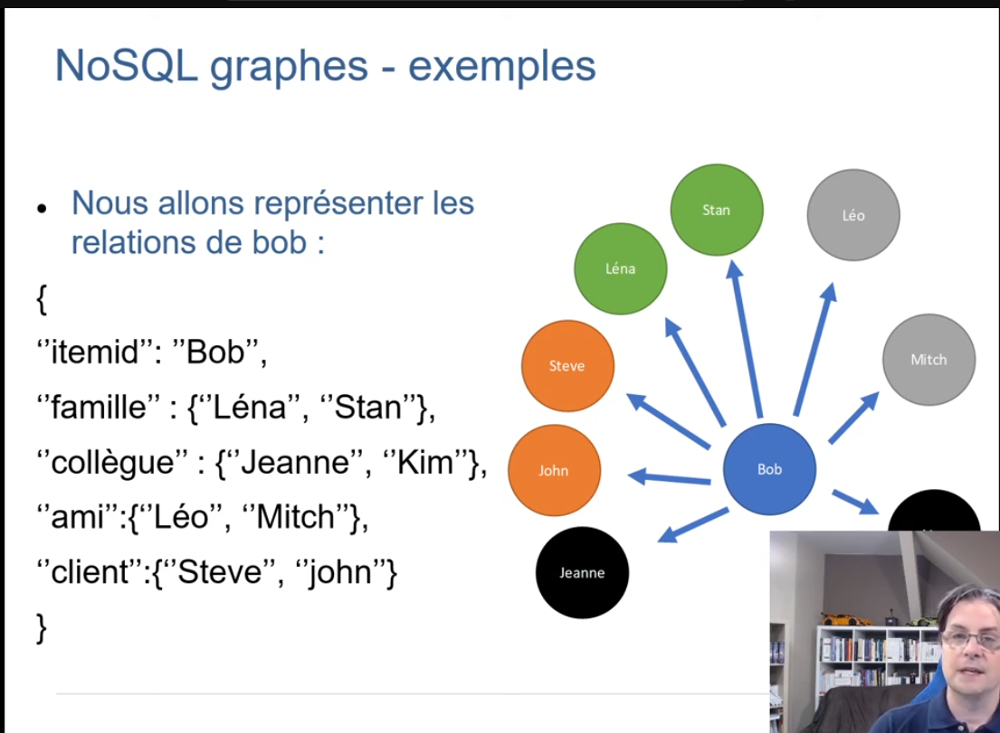
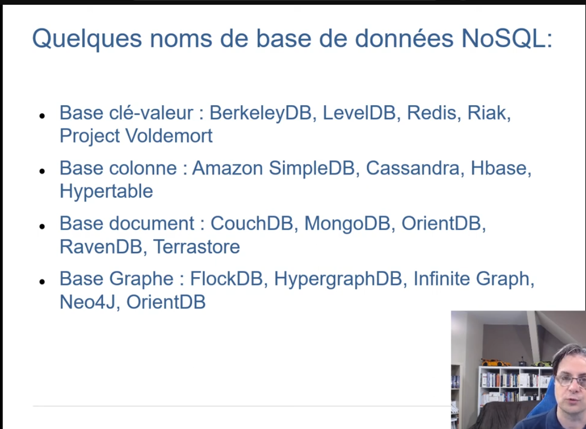

# Les principes du NoSQL

> Toutes les informations viennet de cette vidéo : https://www.youtube.com/watch?v=l8ALv9q8i6Q

## SQL vs NoSQL

- SQL Offre une meilleur fiabilité et cohérence des données. 

- NoSQL Offre de meilleures performances que le SQL car il ne gère aucune règle de cohérence.

- NoSQL est optmisé pour gérer des quantités de données gigantesques en gardant des performances acceptables.

- Etendre SQL est plus couteux qu'étendre NoSQL.

- NoSQL peut utiliser un grand nombre de serveurs peu chers.

## NoSQL se décline en plusieurs variantes dont voici les 4 grandes familles

- Les clés-valeurs
- Les orientés colonnes
- Les documents
- Les graphes

## NoSQL Clé-valeur

- La famille clé-valeur cherche la simplicité avant tout.
- On utilise une clé pour identifier une donnée dans notre base de données.
- Cette donnée peut être de n'importe quel type.
- Puisque toutes les données se retrouvent dans la partie valeur il est impossible de rechercher dans leur contenu.
- Une donnée n'est accessible que via sa clé.

## NoSQL orienté colonne

- Les données sont ici stockées par colonne et non par ligne.
- Chaque colonne contient des valeurs séparées par des virgules.
- Le principal avantage ici est de ne pas parcourir l'ensemble d'une table mais de cibler dès le départ les
colonnes que nous voulons traiter.
- Encore une fois nous ajoutons de la redondance pour améliorer les performances.

## NoSQL documents

- Les bases NoSQL documents essaient d'allier la simplicité des bases clé-valeurs et la structure des bases
de données SQL.
- L'idée est de garder la simplicité de l'utilisation d'une clé pour retourner des données mais cette fois la donnée
sera structurée.
- Puisque la donnée est structurée, il sera alors plus facile de la parcourir.
- Pour la structure, il est commode d'utiliser des comme XML ou JSON.

## NoSQL graphes

- A la différence des autres bases de données, les bases de données graphiques ne cherchent pas à modéliser des entités mais les liens qui relient les occurrences.
- Les bases de données graphiques sont utilisées naturellement pour des applications reliant des concepts comme les réseaux sociaux ou les hiérarchies.
- Ce sont les nœuds, les liens qui sont au centre de la représentation.

## NoSQL associations

## Liste BDD NoSQL

