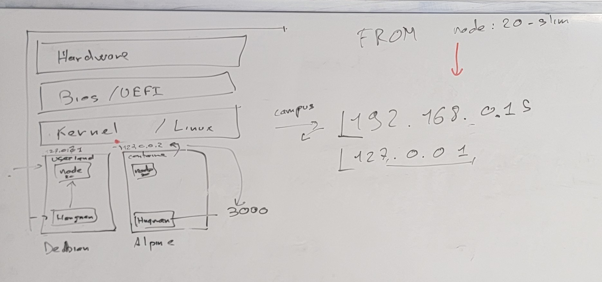

# Docker

- ### Définition:

> Docker est un outil qui peut empaqueter une application et ses dépendances dans un conteneur isolé, qui pourra être exécuté sur n'importe quel serveur

## avantages :

- > Un grand avantage de Docker est la possibilité de modéliser chaque conteneur sous la forme d'une image que l'on peut stocker localement ou sur le Docker Hub, endroit public où de nombreuses images sont publiées et mises à jour régulièrement.

- > Un conteneur est moins figé qu'une machine virtuelle en matière de taille de disque et de ressources allouées.

- > Utiliser Docker pour créer et gérer des conteneurs peut simplifier la mise en œuvre de systèmes distribués en permettant à de multiples applications, tâches de fond et autres processus de s'exécuter de façon autonome sur une seule machine physique ou à travers un éventail de machines isolées.

## installations :

https://docs.docker.com/engine/install/ubuntu/#install-using-the-repository

## Docker commands:

| Commande                      | Ce qu'elle fait                                       |
| ----------------------------- | ----------------------------------------------------- |
| docker ps                     | Liste les conteneurs qui sont actifs                  |
| docker run {nom image}        | lance la conteneurisation d'une image                 |
| docker start {container id}   | démarre un conteneur arrêté                           |
| docker stop {container id}    | arrête un conteneur lancé                             |
| docker logs {container id}    | permet d'afficher les logs d'un conteneur             |
| sudo systemctl stop docker    | Arrêt de docker                                       |
| docker container prune        | delete all stopped containers                         |
| exec -it                      | permet d'éxécuter une commande dans le conteneur      |
| docker volume ls              | liste les volumes                                     |
| docker ps -q                  | Lists the IDs of all running containers.              |
| docker stop $(docker ps -q)   | permet de stopper tous les conteneurs en route        |
| docker rm -f $(docker ps -aq) | permet de stopper et de supprimer tous les conteneurs |

## Docker options:

| option          | à quoi elle sert                                                                              |
| --------------- | --------------------------------------------------------------------------------------------- |
| -p 8080:80      | bind le port de l'image dans docker avec le port précisé dans la commande sur la machine hote |
| -d ou --detache | lance un conteneur sans les logs                                                              |
| --rm            | permet de spécifier de supprimer le conteneur lorsqu'il sera arrêté                           |
| -v              | permet de déclarer un volume persistant                                                       |
|                 |                                                                                               |

- ## mariadb volume container run:

```
sudo docker exec -it silly_gagarin mariadb -uroot -p
```

| sudo docker             | exec -it                                         | silly_gagarin       | mariadb -uroot -p                        |
| ----------------------- | ------------------------------------------------ | ------------------- | ---------------------------------------- |
| Commande docker de base | permet d'éxécuter une commande dans le conteneur | le nom du conteneur | la commande à éxécuter dans le conteneur |

> permet d'ouvrir et de se connecter à mariadb

- ## mariadb connection line example:

```
sudo docker run -v backup-volume:/var/lib/mysql -d -p 3307:80 --env MARIADB_ROOT_PASSWORD=root mariadb:latest
```

| -v                                   | backup-volume | :/var/lib/mysql                                  |
| ------------------------------------ | ------------- | ------------------------------------------------ |
| tag permettant de signaler un volume | nom du volume | répertoire sur la machine qui contient le volume |

> permet de lancer un conteneur en utilisant un volume pour faire persister des données.

- ## écrire un docker file

https://blog.stephane-robert.info/docs/conteneurs/images-conteneurs/ecrire-dockerfile/

- ## Principe de docker et comment les conteneurs communiquent avec les autres programmes.

  

- ## docker compose

- ## Sécuriser le conteneur

Il faut changer le nom dans le docker file lors du runner et ajouter --chown=node:node avant chaques COPY

PUIS rebuild l'image du conteneur!!

```dockerfile
# We start for a docker image named "node:20-slim"
# see https://hub.docker.com/_/node
# We use base as an alias name
FROM node:20-slim AS base
# We'll work inside the directory /app
WORKDIR /app

######################################
# First stage (build the app)
FROM base as builder
# Copy project file
COPY . .
# Run npm install
# We use "npm ci" instead of "npm install"
# Read https://docs.npmjs.com/cli/v7/commands/npm-ci for explaination
RUN npm ci
# We run our custom build script
RUN npm run build

######################################
# Second stage (build the production container)
FROM base AS runner

# our base image "node" has a user named "node"
# After that line, all command run inside the conatiner will be launched by the "node" user
USER node

# Here we copy a file from "builder" stage to the current "runner" stage
# We also need to change the owner of the files to ensure the "node" user can access them
COPY --from=builder --chown=node:node /app/node_modules /app/node_modules
# TODO Add missing COPY to complete the production container
# ......

# The container will expose port 3000
EXPOSE 3000

# Start command to use for the conaitner
CMD node api/api.js
```

## variables 

- gitlab nous propose des variables qui existet déjà et permetent de récupérer par exmple le nom de la branche sur laquelle leprojet est publié et permet comme ça de diviser le projet en plusieur dossier sur le serveur et de dynamiquement créer un dossier production et un autre developpement par exemple pour tester ou développer.

Exemple de fichier .gilab-ci.yml avec la variable dynamique $CI_COMMIT_BRANCH:

```yml
# You'll need to add this on top of your file
# This is a requireded configuration for the Gitlab-Runner (see in 'build' job for more information)
variables:
  DOCKER_HOST: tcp://docker:2376
  DOCKER_TLS_VERIFY: "true"
  DOCKER_TLS_CERTDIR: "/certs"
  DOCKER_CERT_PATH: "$DOCKER_TLS_CERTDIR/client"
  DOCKER_DRIVER: overlay2


# We use a pipeline with 2 stage
stages:
  # the first stage>
  - test
  # the second stage>
  - build
  # the third stage>
  - deploy

vitest:
  image: node:20
  stage: test
  before_script:
    - npm ci
  script:
    - npm run test:ci
  artifacts:
    when: always
    reports:
      junit:
        - ./junit-report.xml


# The build job
build:
  when: always
  # We use the image named "docker" this image is usefull to run docker inside docker (aka DinD)
  # This is required because docker use docker image internally to build other docker image
  image: docker:24.0.5
  # We'll use the DinD service ,so we need to declare it
  # This service is installed on the Gitlab-Runner (The machine where your Jobs are executed)
  services:
    - docker:24.0.5-dind-rootless
  stage: build
  script:
    - echo "$CI_REGISTRY_PASSWORD" | docker login $CI_REGISTRY -u $CI_REGISTRY_USER --password-stdin
    - docker build -t registry.minimmo.fr/antoine.donatgoninet/hangman:$CI_COMMIT_BRANCH .
    - docker push registry.minimmo.fr/antoine.donatgoninet/hangman:$CI_COMMIT_BRANCH


deploy:
  stage: deploy
  when: always
  before_script:
    - install_packages openssh-client
    - eval $(ssh-agent -s)
    - echo "$SSH_PRIVATE_KEY" | tr -d '\r' | ssh-add -
    - mkdir -p ~/.ssh
    - chmod 700 ~/.ssh
    - ssh-keyscan 46.105.146.174 >> ~/.ssh/known_hosts
    - chmod 644 ~/.ssh/known_hosts

  script:
#    - ssh debian@46.105.146.174 "docker pull registry.minimmo.fr/antoine.donatgoninet/hangman:$CI_COMMIT_BRANCH"
    - ssh debian@46.105.146.174 "cd $CI_COMMIT_BRANCH/ && docker pull registry.minimmo.fr/antoine.donatgoninet/hangman:$CI_COMMIT_BRANCH && docker compose pull && docker compose up -d;"
```

## docker networks

Les networks permettent de connecter ou séparer les conteneurs entre eux et de faire communiquer uniquement entre eux ceux que l'on veut.

fichier traefik

```yml
name: "hangman" # le nom sera en préfixe du nom du network dans les autres conteneneurs
services:
  # Declare a Traefik Reverse proxy
  traefik:
    image: "traefik:v3.2"
    container_name: "traefik"

    networks:
      - network

networks:
  network:
```

Fichier de la branche prod

```yml
services:
  hangman:
    image: registry.minimmo.fr/antoine.donatgoninet/hangman:prod

    expose:
      - "3000"

    networks:
      - hangman_network #le nom du network préfixé par le nom du contenenur qui initialise le network

networks:
  hangman_network: #le nom du network préfixé par le nom du contenenur qui initialise le network
    external: true
```
