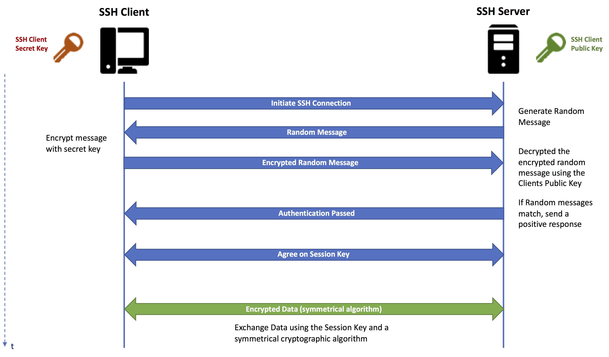

# comment se connecter à une autre machine

https://doc.ubuntu-fr.org/ssh

- ## principe de la connexion ssh :

### 1. **Le principe des clés publiques et privées :**
En cryptographie, on utilise deux clés :
- Une **clé publique** : qui peut être partagée avec tout le monde.
- Une **clé privée** : qui doit rester secrète.

Le principe clé est :
- **Ce qui est chiffré avec la clé publique ne peut être déchiffré qu'avec la clé privée**.
- Et inversement, ce qui est chiffré avec la clé privée peut être vérifié ou déchiffré avec la clé publique (utilisé pour les signatures numériques).

### 2. **Comment ça marche ?**
Imaginons une boîte :
- La **clé publique** permet de verrouiller (chiffrer) la boîte.
- Seule la **clé privée** correspondante peut déverrouiller (déchiffrer) la boîte.

Donc, si quelqu'un veut vous envoyer un message secret :
- Il utilise votre **clé publique** pour le chiffrer.
- Seule votre **clé privée** peut déchiffrer ce message.

### 4. **Utilisation dans SSH :**
Lors d'une connexion SSH, la clé publique est stockée sur le serveur, et la clé privée reste sur votre ordinateur. Le serveur envoie un message chiffré avec votre clé publique, que seul votre ordinateur (avec la clé privée) peut déchiffrer. Cela garantit une connexion sécurisée.

En bref :
- **Clé publique** : pour chiffrer, peut être partagée.
- **Clé privée** : pour déchiffrer, doit rester secrète.

## configurer un serveur

https://www.digitalocean.com/community/tutorials/how-to-install-linux-nginx-mysql-php-lemp-stack-on-ubuntu-20-04-fr

## installer le certificat ssl sur le site et le serveur: 

https://www.digitalocean.com/community/tutorials/how-to-secure-nginx-with-let-s-encrypt-on-ubuntu-20-04-fr
